# Exercise 1: Apply a workflow template to a repository

> [!TIP]
> Learn basics about GitHub Actions from [official documentation](https://docs.github.com/en/actions/about-github-actions/understanding-github-actions).

The main input for every CI/CD process is the project you want to build and potentially deploy somewhere.

For the purpose of this workshop, this repository contains a solution with an ASP.NET Core web API project (a REST service) and an accompanying test project. During the workshop, you will build this project, run the tests, and include test results and code coverage report in the job summary.

You will not deploy the service anywhere, as that would require access to a hosting provider and the configuration details are specific to the hosting provider. However, the experience gained during the workshop should give you the knowledge needed to deploy a service to a hosting provider of choice.

## Step 1: Fork the repository

To freely configure and run the workflow during the workshop, you will have to do it in your own GitHub repository, so your first step will be to [create a fork](https://docs.github.com/en/pull-requests/collaborating-with-pull-requests/working-with-forks/fork-a-repo) of this repository to your account.

1. Navigate to the root **Code** page of the repository.

   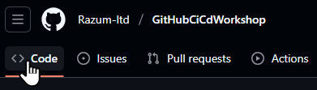

2. Click the **Fork** button in the top right of the page.

   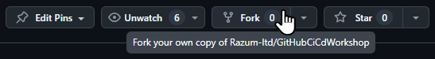

3. Select the correct **Owner** from the dropdown and modify the **Repository name** to your liking.

   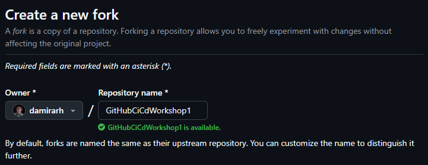

4. Click **Create fork** to complete the operation.

   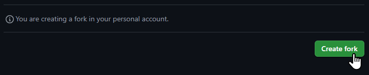

5. You will be navigated to the home page of the newly create fork of the repository.

   

## Step 2: Choose a workflow template

GitHub Actions workflows are defined in YAML files. Although you can always create a workflow from scratch, there is an easier way to start, especially for beginners. There is a large selection of workflow templates available from which you can choose. You can find one for almost any type of project you can imagine. Of course, there are also several templates for .NET projects like the one you are working with in this workshop.

1. Navigate to the **Actions** page of your repository.

   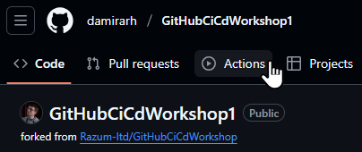

2. There is a selection of templates **Suggested for this repository**, but none of them does exactly what we need: build an ASP.NET Core project and run the tests.

   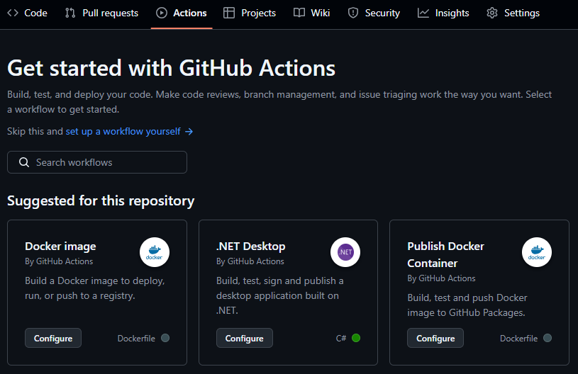

3. Type **.NET** in the **Search workflows** field to find other templates for .NET projects.

   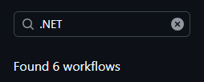

4. Inspect the search results. The **.NET By GitHub Actions** workflow template seems a good fit for our needs. Choose it by clicking its **Configure** button.

   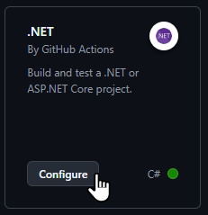

5. A preview of the YAML workflow file from the template will be shown to you, and you will get a chance to modify it in the editor.

   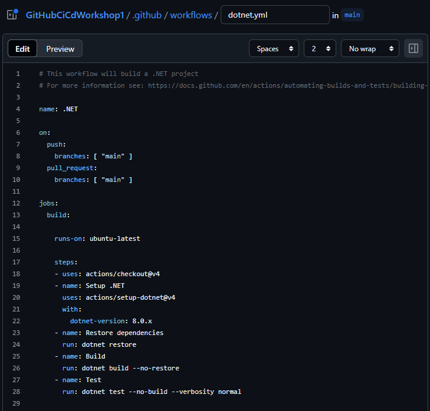

6. There is no need to change anything in the workflow file for now. Click the **Commit changes...** button in the top right of the page to add the file to your repository.

   

7. You get a chance to modify the commit message to be used. Click the **Commit changes** button to confirm the commit.

   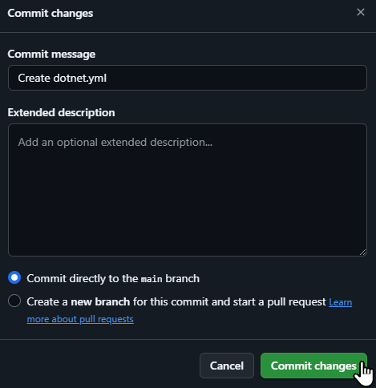

## Step 3: Review the workflow run

The workflow template is configured to trigger on each push to `main` branch, so the run was triggered as soon as you completed your commit. You can now check the workflow run outcome.

1. Navigate to the **Actions** page of your repository.

   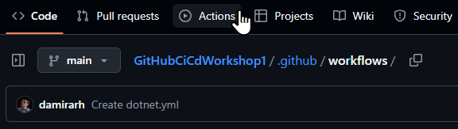

2. It will show you a list of all workflow runs. At this point in time there will only be the one which was just triggered. Click on it to see its details.

   ![[e1-e3-i2.png]]

3. The details include information on how the run was **Triggered**, its **Status** and **Total duration**. Click on its only job, **build** to see the logs.

   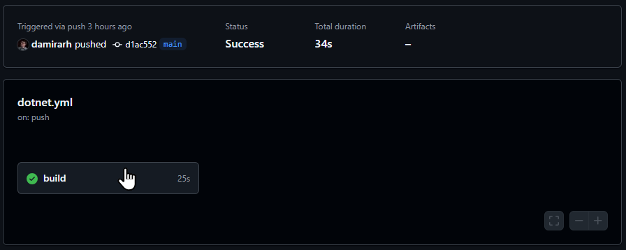

4. Log entries are grouped into sections, corresponding to individual steps. Click on a section to expand it and see its log entries.

   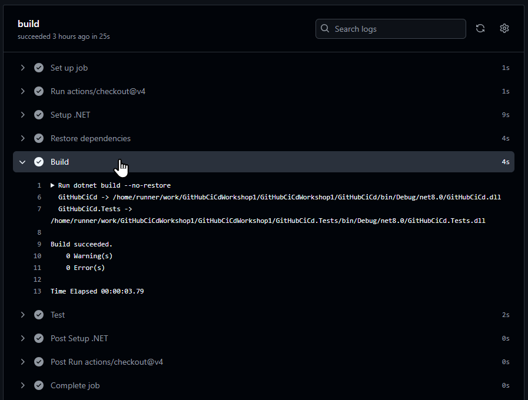
