# Exercise 2: Modify the workflow in an editor

> [!TIP]
> Learn about workflow syntax for GitHub Actions from [official documentation](https://docs.github.com/en/actions/writing-workflows/workflow-syntax-for-github-actions).

The workflow from the template you applied to your repository is fully defined in the `.github/workflows/dotnet.yml` file. Any changes to the workflow will be done by modifying this file.

There are many ways to do it:

- You can edit the file directly in GitHub using [a dedicated editor](https://github.blog/news-insights/product-news/new-workflow-editor-for-github-actions/).
- You can use the GitHub's [web-based editor](https://docs.github.com/en/codespaces/the-githubdev-web-based-editor).
- You can edit the file locally in your text editor of choice.

In this workshop, you will learn to use Visual Studio Code For development of GitHub Actions workflows.

## Step 1: Clone the repository

To edit the workflow file in a local text editor, you first have to [make a local clone of the repository](https://code.visualstudio.com/docs/sourcecontrol/intro-to-git#_clone-a-repository-locally).

1. Open a new Visual Studio Code window.
2. Open the **Source control** view.

   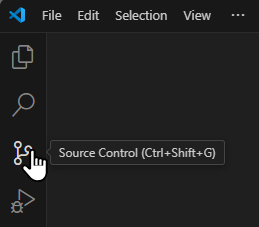

3. Click on the **Clone repository** button.

   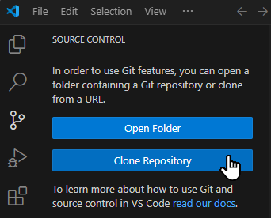

4. Click the **Clone from GitHub** option in the menu which appears.

   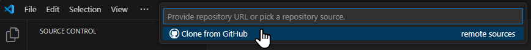

5. If you aren't signed in to GitHub inside Visual Studio Code, you will need to **Allow** it to sign in.

   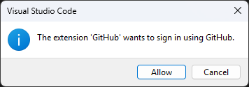

6. The authorization will take place in your browser. You will need to select the user to sign in with.

   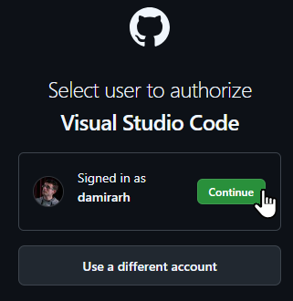

7. And finally **Open Visual Studio Code** via the redirect link.

   ![[e2-e1-i7.png]]

8. Once You are signed in to GitHub in Visual Studio Code, you can select your workshop repository to clone. Type a part of its name into the text box to find the repository faster.

   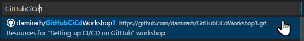

9. A file system dialog will open to **Choose a folder to clone into**. Click the **Select as Repository Destination** button to confirm your choice.

   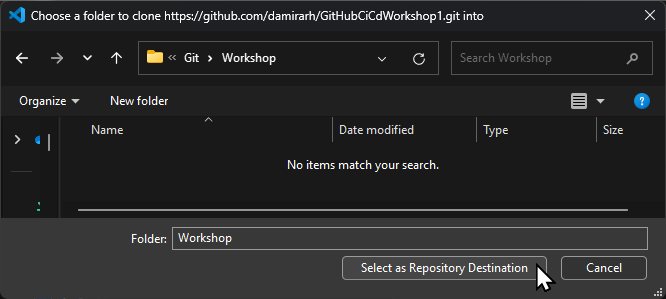

10. Click **Open** to open the folder with the cloned repository in your current Visual Studio Code window.

    ![[e2-s1-i10.png]]

## Step 2: Add manual trigger for the workflow

With the current configuration, the only way to trigger the workflow is by pushing a commit to the `main` branch or by pushing a commit to a branch with a pull request targeting the `main` branch. It's often useful to be able to [trigger a workflow manually](https://docs.github.com/en/actions/writing-workflows/choosing-when-your-workflow-runs/triggering-a-workflow). Let's add such a trigger to our workflow.

1. Open the `.github/workflows/dotnet.yml` file from the cloned repository in Visual Studio Code.
2. Add `workflow_dispatch` to the list of triggers and save the file:
   ```yaml
   on:
     push:
       branches: ["main"]
     pull_request:
       branches: ["main"]
     workflow_dispatch:
   ```
3. Open the **Source control** view in Visual Studio Code to commit the change. You can see the file you modified in the list of **Changes**.

   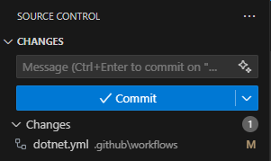

4. Click on the `+` button next to the file to **Stage Changes**.

   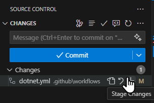

5. Add a commit message and click the **Commit** button.

   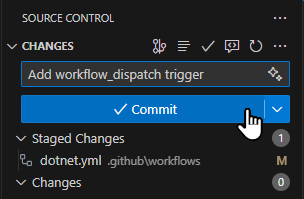

6. Click the **Sync Changes** button to push the commit to the remote repository.

   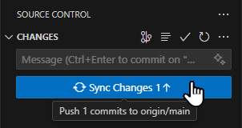

7. Click **Ok** to confirm the action.

   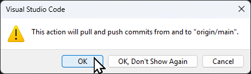

## Step 3: View and trigger a workflow run inside Visual Studio Code

With [GitHub Actions for VS Code](https://marketplace.visualstudio.com/items?itemName=GitHub.vscode-github-actions) extension installed, you can view the workflow and their logs without ever leaving Visual Studio Code.

1. Open the **GitHub Actions** view in Visual Studio Code.

   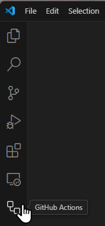

2. If the extension is not yet signed in to GitHub, click the **Sign in to GitHub** button.

   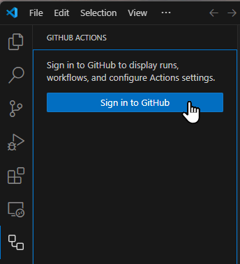

3. Click the **Allow** button in the dialog box to open the authorization page in your browser. Follow the same steps as when signing in with the GitHub extension.

   

4. Once you are signed in to GitHub with the extension, you should see two build of the .NET workflow on your current branch. If you only see one, click the **Refresh current branch** button.

   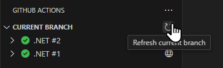

5. Expand the .NET #2 workflow run node in the tree view to see the job and its steps.

   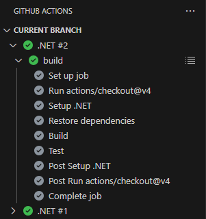

6. Click the **View job logs** button to open the logs in the editor. All the log entries for a job are shown as a single plain text file without any grouping by steps. You can notice the `##[group]` and `##[endgroup]` entries in the file, which are used by the web-based log viewer to group the entries.

   

7. To trigger a new workflow run manually (now that you have added a manual trigger), click the "right arrow play" button for the .NET workflow.

   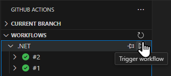

8. Press **Enter** to confirm triggering the workflow on the `main` branch.

   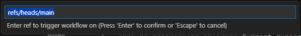

9. To do the same from the GitHub web page of your repository, navigate to the **Actions** page, click on the **.NET** workflow in the sidebar, open the **Run workflow** dropdown and click on the **Run workflow** button.

   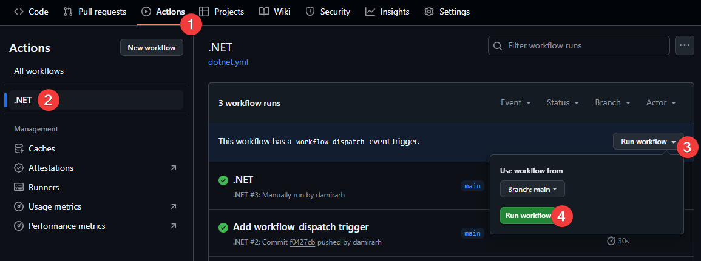
