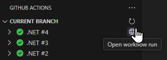
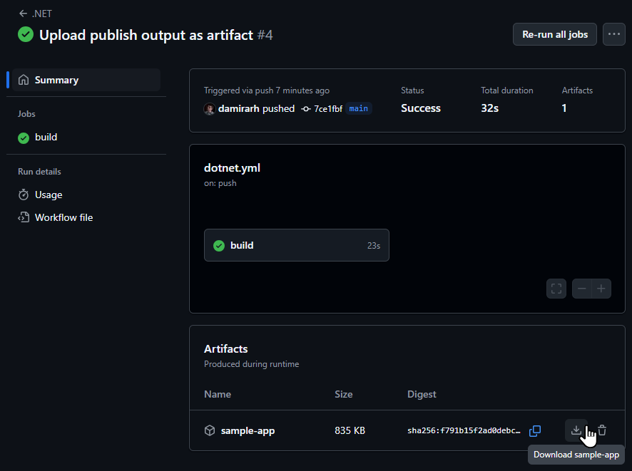
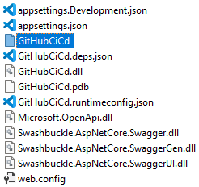

# Exercise 3: Upload workflow artifacts

> [!TIP]
> Learn about workflow artifacts in GitHub Actions from [official documentation](https://docs.github.com/en/actions/writing-workflows/choosing-what-your-workflow-does/storing-and-sharing-data-from-a-workflow).
>
> Learn about expression evaluation in GitHub Actions from [official documentation](https://docs.github.com/en/actions/writing-workflows/choosing-what-your-workflow-does/evaluate-expressions-in-workflows-and-actions).

Usually, CI/CD processes produce outputs, which can be accessed at a later time. In GitHub Actions, such outputs are persisted as workflow artifacts. They are also used for sharing files between jobs in a workflow run because jobs in the same run don't share their environment.

A common artifact to share between jobs is a deployment package: it is created by one job and deployed by another job. In this workshop, we will create such a deployment package for our sample project and upload it as an artifact. Instead of deploying it from a second job, we will only download it and inspect its contents locally.

## Step 1: Publish the project

.NET projects can be prepared for deployment using the [publish command](https://learn.microsoft.com/en-us/dotnet/core/tools/dotnet-publish). It creates a folder with files for deployment which can be uploaded as an artifact using the [`upload-artifact` action](https://github.com/marketplace/actions/upload-a-build-artifact).

1. Open the `.github/workflows/dotnet.yml` file from the cloned repository in Visual Studio Code.
2. Add a new step at the end of the `build` job to publish the ASP.NET Core web API service. In the command, explicitly specify the project file (`./GitHubCiCd/GitHubCiCd.csproj`) and the output folder (`./sample-app`).
   ```yaml
   - name: Publish
     run: dotnet publish ./GitHubCiCd/GitHubCiCd.csproj --output ./sample-app
   ```
3. Add a new step at the end of the `build` job to upload the output folder from the previous step as an artifact. Specify the name for the artifact. Add an `if` conditional to not upload the artifacts when the run is triggered for a pull request.
   ```yaml
   - name: Upload artifact
     uses: actions/upload-artifact@v4
     if: github.event_name != 'pull_request'
     with:
       name: sample-app
       path: ./sample-app
   ```
4. Commit and push the changes from **Source control** view in Visual Studio Code.

## Step 2: Download and view the artifact

You would usually deploy the uploaded artifact from a second job. In this workshop, you will download the file instead and view its contents locally.

1. Open the **GitHub Actions** view in Visual Studio Code. Click the **Open workflow run** button next to the latest workflow run to open the workflow run summary page in the browser. Click the **Refresh current branch** button to refresh the view if the latest run is not listed.

   

2. Notice the `sample-app` artifact listed at the bottom of the page. Click the **Download sample-app** button next to it to download the file.

   

3. View the contents of the downloaded `.zip` archive in your tool of choice. Look at the binary and configuration files it contains.

   
