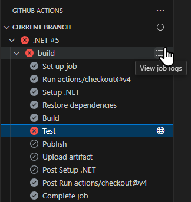
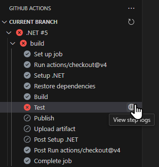
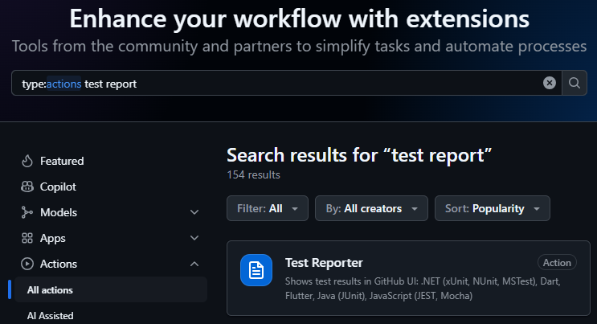
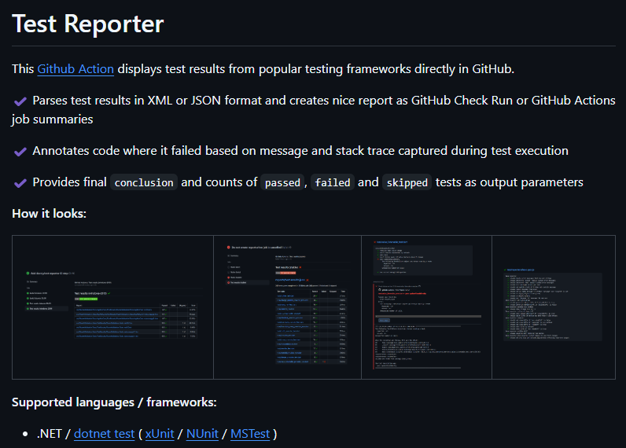
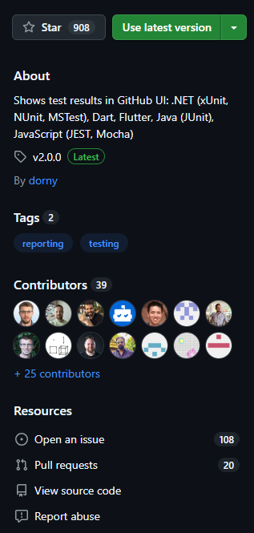
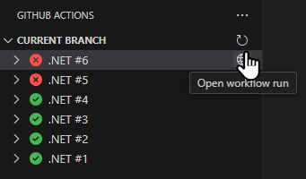
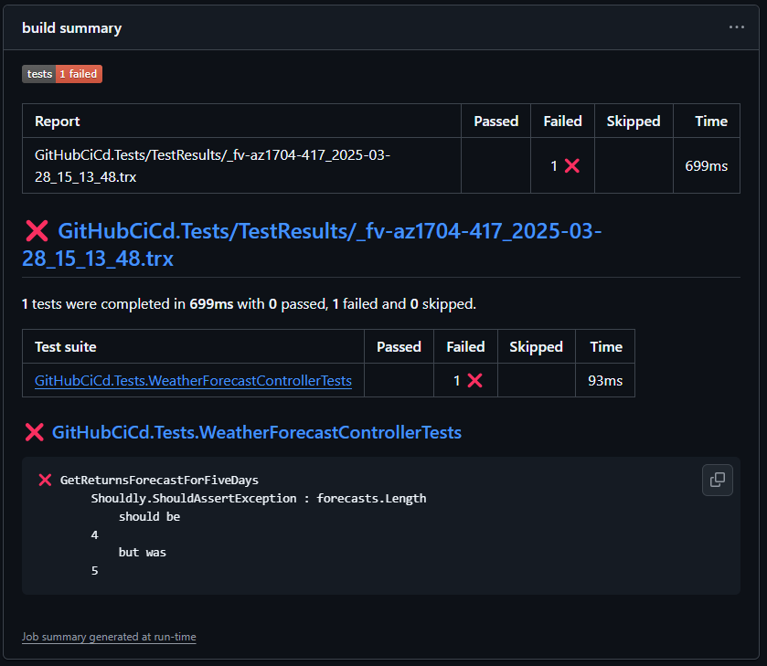
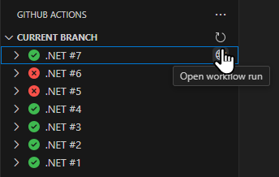
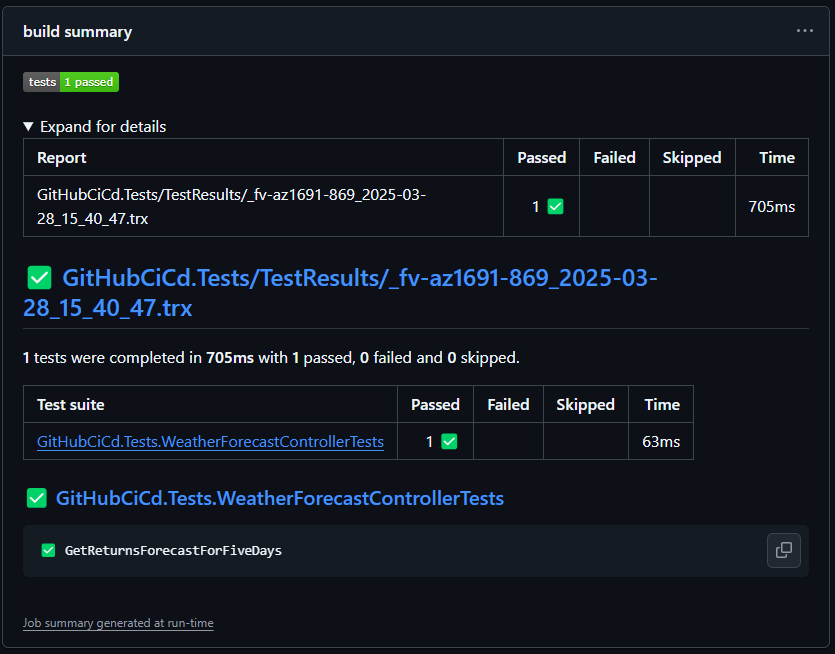

# Exercise 4: Generate test report

> [!TIP]
> Learn about including pre-written actions in your GitHub Actions workflow from [official documentation](https://docs.github.com/en/actions/writing-workflows/choosing-what-your-workflow-does/using-pre-written-building-blocks-in-your-workflow).

A failing test would cause our workflow to fail at the **Test** step. However, the details about the failing test could only be found in the workflow run logs. Ideally, we would want this information to be more easily discoverable.

When we think of a new requirement for our workflow, it's unlikely that we are the first person to do so. Our first instinct should therefore be to search for an action in [GitHub Marketplace](https://github.com/marketplace?type=actions), which does what we need. In this particular case, that would be an action for uploading generating and uploading a report with unit test results (for a .NET project or more general).

## Step 1: Cause a test to fail and search for the error in the logs

Before changing anything in the workflow, let's cause a test in our project to fail and try to find more information about it in the workflow run results.

1. Open the `GitHubCiCd.Tests/WeatherForecastControllerTests.cs` file from the cloned repository in Visual Studio Code.
2. Find the only assertion in the only test in the file:
   ```csharp
   forecasts.Length.ShouldBe(5);
   ```
3. Obviously, the test asserts that the returned array of `forecasts` contains 5 items. At this point, we don't care why it is so. But we can assume that the test will fail if change the assertion to expect a different number of items in the array. Let's change it to 4:
   ```csharp
   forecasts.Length.ShouldBe(4);
   ```
4. Commit and push the changes from **Source control** view in Visual Studio Code.
5. Open the **GitHub Actions** view in Visual Studio Code. Notice the failed test run in the tree view. Click the **Refresh current branch** button to refresh the view if the latest run is not listed. Expand the tree view to see that the **Test** step was the one that failed. Click the **View job logs** button to open the logs in the editor.

   

6. Read through the log until you find the details about the failing test. You should eventually be able to find the following log entries:
   ```
   2025-03-28T11:18:11.1966548Z NUnit Adapter 5.0.0.0: Test execution complete
   2025-03-28T11:18:11.3116246Z   Failed GetReturnsForecastForFiveDays [95 ms]
   2025-03-28T11:18:11.3127200Z   Error Message:
   2025-03-28T11:18:11.3127658Z    Shouldly.ShouldAssertException : forecasts.Length
   2025-03-28T11:18:11.3128143Z     should be
   2025-03-28T11:18:11.3128357Z 4
   2025-03-28T11:18:11.3128540Z     but was
   2025-03-28T11:18:11.3128698Z 5
   2025-03-28T11:18:11.3128852Z   Stack Trace:
   2025-03-28T11:18:11.3129724Z      at GitHubCiCd.Tests.WeatherForecastControllerTests.GetReturnsForecastForFiveDays() in /home/runner/work/GitHubCiCdWorkshop1/GitHubCiCdWorkshop1/GitHubCiCd.Tests/WeatherForecastControllerTests.cs:line 17
   2025-03-28T11:18:11.3130915Z    at System.RuntimeMethodHandle.InvokeMethod(Object target, Void** arguments, Signature sig, Boolean isConstructor)
   2025-03-28T11:18:11.3131619Z    at System.Reflection.MethodBaseInvoker.InvokeWithNoArgs(Object obj, BindingFlags invokeAttr)
   2025-03-28T11:18:11.3131985Z
   2025-03-28T11:18:11.3137672Z
   2025-03-28T11:18:11.3176006Z Test Run Failed.
   2025-03-28T11:18:11.3176353Z Total tests: 1
   2025-03-28T11:18:11.3176746Z      Failed: 1
   2025-03-28T11:18:11.3187124Z  Total time: 0.6879 Seconds
   ```
7. Admittedly, all the information you might be interested in is present in the file. But it's not that easy to find. And it would be even more difficult to find, if the log was longer. Let's see, if it's any easier to find on the web page. Click the **View step logs** button next to the failing **Test** step.

   

8. A web page with only the logs for that step expanded will open. This will make finding the error details a bit easier:

   

## Step 2: Generate a test report and use it to identify the failing test

We can do better. Let's find an action in GitHub Marketplace to help us with that and add it to our workflow.

1. Open the [GitHub Marketplace](https://github.com/marketplace?type=actions) page in your browser. Search for `test report`. Make sure to keep the `type:actions` string in the text box.

   

2. Click on the first search result: **Test reporter** to see its details. You can see in its description that it supports all .NET testing frameworks. According to attached screenshots, any failing tests and the reasons for them are clearly visualized. It looks like the action is what we need.

   

3. Before deciding to use this action, we want to evaluate how trustworthy it is and how well it is maintained. This can be best established by looking at the information on the right of the page. The action author is not verified. However, the action has a lot of stars, and the project has several contributors. There are many open issues, but this can also be a sign of many users. It might make sense to check those issues and see if any of them are about functionalities you want to use. If you click on the **View source code** link, you can see that the latest version has been released not long ago, which shows that the project is still active.

   

4. To add the action to the workflow, open the `.github/workflows/dotnet.yml` file from the cloned repository in Visual Studio Code.
5. The action requires test results in Visual Studio Test Results (`.trx`) files. Modify the command in the **Test** step to make [the `dotnet test` command](https://learn.microsoft.com/en-us/dotnet/core/tools/dotnet-test?tabs=dotnet-test-with-vstest#examples) generate such a file:
   ```yaml
   - name: Test
     run: dotnet test --no-build --verbosity normal --logger trx
   ```
6. Add a new step immediately after the **Test** step, which [invokes the selected `test-reporter` action](https://github.com/marketplace/actions/test-reporter#example). Make sure to correctly set the `path` and `reporter` input parameters for your case. And don't forget to add the `if` conditional, which makes sure that the step will run even if the previous step failed. We want to see the results even (or especially) when the **Test** action failed because not all tests have passed.
   ```yaml
   - name: Generate test summary
     uses: dorny/test-reporter@v2
     if: success() || failure()
     with:
       name: Tests
       path: GitHubCiCd.Tests/TestResults/*.trx
       reporter: dotnet-trx
   ```
7. Commit and push the changes from **Source control** view in Visual Studio Code.
8. Open the **GitHub Actions** view in Visual Studio Code. Click the **Refresh current branch** button to refresh the view and see the latest failed run. Click on the **Open workflow run** button next to it to open the workflow run summary page.

   

9. Notice the **build summary** section with test results and detailed information about the failing test readily available for you. There is no need to search the logs for this information anymore.

   

## Step 3: Fix the failing test and view the report for passing tests

Before continuing, let's fix the tests, so that the workflow run will succeed again.

1. Open the `GitHubCiCd.Tests/WeatherForecastControllerTests.cs` file from the cloned repository in Visual Studio Code.
2. Revert the modified assertion back to its original state, i.e. change the expected value back to 5:
   ```csharp
   forecasts.Length.ShouldBe(5);
   ```
3. Commit and push the changes from **Source control** view in Visual Studio Code.
4. Open the **GitHub Actions** view in Visual Studio Code. Click the **Refresh current branch** button to refresh the view and see the latest successful run. Click on the **Open workflow run** button next to it to open the workflow run summary page.

   

5. Notice how the **build summary** section with test results is now collapsed by default, so that only a badge with the number of passing tests is visible. You can expand it to see all the details.

   
