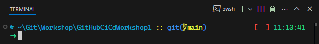
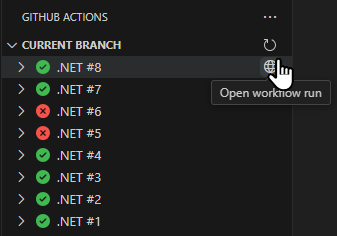
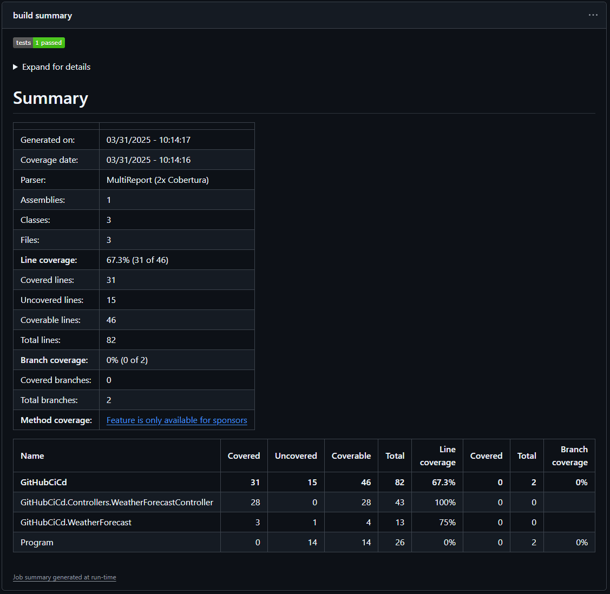

# Exercise 5: Generate code coverage report

> [!TIP]
> Learn about job summaries in GitHub Actions from [official documentation](https://docs.github.com/en/actions/writing-workflows/choosing-what-your-workflow-does/workflow-commands-for-github-actions#adding-a-job-summary).
>
> Learn about .NET local tools from [official documentation](https://learn.microsoft.com/en-us/dotnet/core/tools/global-tools).

The test report from the previous exercise was added as a job summary to the workflow run overview page. Any other information in Markdown format can easily be added there, even without a dedicated action. To learn about this process, we will generate a code coverage report in Markdown format and add it to the job summary.

To create the code coverage report, we will use a .NET local tool. These are installed using the NuGet package manager. Although, this tooling is .NET specific, the approach is similar to commands installed with package managers in other developer ecosystems. They can all easily be used from GitHub Actions workflows.

## Step 1: Install local tool for generating code coverage report

For generating a code coverage report in Markdown format, we will use the [ReportGenerator](https://reportgenerator.io) tool. When used for a .NET project, it can be installed as a local tool.

1. Open a terminal window in Visual Studio Code using the **View > Terminal** menu item. It will automatically open in the root folder currently open in Visual Studio Code. That should be the root of your cloned repository, which is where you will have to run the command.

   

2. Run the following command to initialize a new manifest file for .NET local tools in the root folder of your repository:
   ```shell
   dotnet new tool-manifest
   ```
3. Run the following command to [install the ReportGenerator as a .NET local tool](https://www.nuget.org/packages/dotnet-reportgenerator-globaltool) and add it to the manifest file:
   ```shell
   dotnet tool install dotnet-reportgenerator-globaltool
   ```
4. To run those two commands, you need to have [.NET 8 SDK](https://dotnet.microsoft.com/en-us/download) installed. If you don't have it installed, you can manually create a file which would be generated by those two commands, i.e., `.config/dotnet-tools.json` with the following contents:
   ```json
   {
     "version": 1,
     "isRoot": true,
     "tools": {
       "dotnet-reportgenerator-globaltool": {
         "version": "5.4.5",
         "commands": ["reportgenerator"],
         "rollForward": false
       }
     }
   }
   ```

## Step 2: Generate code coverage report in workflow and upload it as job summary

To run ReportGenerator from a GitHub Actions workflow, a .NET tools manifest file with it installed must be added to the repository and the tools must be installed at the start of each run. Then, the command can be invoked just like any other locally available command line executable.

1. Open the `.github/workflows/dotnet.yml` file from the cloned repository in Visual Studio Code.
2. Add a new step immediately after the **Restore dependencies** step. It must be placed after the **Setup .NET** step (because it requires .NET to be installed) and before invoking the ReportGenerator tool (because this step will install it). In the command, restore the .NET local tools from the manifest file:
   ```yaml
   - name: Restore local tools
     run: dotnet tool restore
   ```
3. ReportGenerator requires Cobertura files to generate the report. Modify the command in the **Test** step to make [the `dotnet test` command](https://learn.microsoft.com/en-us/dotnet/core/tools/dotnet-test?tabs=dotnet-test-with-vstest#examples) generate such a file using [Coverlet](https://github.com/coverlet-coverage/coverlet/blob/master/README.md#usage-coverletcollector):
   ```yaml
   - name: Test
     run: dotnet test --no-build --verbosity normal --logger trx --collect:"XPlat Code Coverage"
   ```
4. Add a new step after the **Test** step, which invokes ReportGenerator to create a code coverage report in Markdown format. Notice the arguments specifying the input files, the output folder and the report format. Don't forget to the `if` conditional, to get the coverage report even when the **Test** action failed because not all tests have passed.
   ```yaml
   - name: Generate code coverage report
     run: dotnet reportgenerator -reports:**/coverage.cobertura.xml -targetdir:./coverage -reporttypes:MarkdownSummary
     if: success() || failure()
   ```
5. Add another step immediately after the newly added **Generate code coverage report** step to upload the generated Markdown report as a job summary. Since we need to write the job summary into the `$GITHUB_STEP_SUMMARY` environment variable, we will use the standard `cat` command and redirect output accordingly. And don't forget about the `if` conditional again, to upload the report even in case of a previous failure.
   ```yaml
   - name: Upload code coverage report
     run: cat coverage/Summary.md >> $GITHUB_STEP_SUMMARY
     if: success() || failure()
   ```
6. Commit and push the changes (in both files: `.config/dotnet-tools.json` and `.github/workflows/dotnet.yml`) from **Source control** view in Visual Studio Code.
7. Open the **GitHub Actions** view in Visual Studio Code. Click the **Refresh current branch** button to refresh the view and see the latest run. Click on the **Open workflow run** button next to it to open the workflow run summary page.

   

8. Notice the generated code coverage report in the **build summary** section, below the collapsed test results.

   
