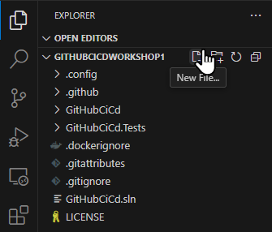
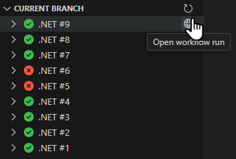
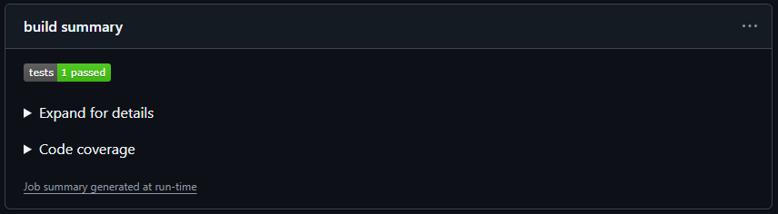

# Exercise 6: Custom action for uploading job summaries

> [!TIP]
> Learn about custom actions for GitHub Actions from [official documentation](https://docs.github.com/en/actions/sharing-automations/creating-actions/about-custom-actions).
>
> Learn about creating a JavaScript action from [official documentation](https://docs.github.com/en/actions/sharing-automations/creating-actions/creating-a-javascript-action)
>
> Learn about action metadata from [official documentation](https://docs.github.com/en/actions/sharing-automations/creating-actions/metadata-syntax-for-github-actions).

We can improve the final job summary by collapsing the code coverage report by default, similar to how test report is collapsed when there are no failing tests. Although this could be achieved directly in the workflow file, we will use this opportunity to create our own JavaScript action, which we will then simply invoke from the workflow file.

## Step 1: Create the action metadata file

Each action must have a metadata file describing its inputs, outputs and runtime environment. According to [the official guidance](https://docs.github.com/en/actions/sharing-automations/creating-actions/about-custom-actions#choosing-a-location-for-your-action) we will create our private JavaScript action in a subfolder inside `.github/actions`. We will place all action files there, including the metadata file.

1. Click on the **New File...** button next to the name of the workspace in the **Explorer** view of Visual Studio Code. Enter `.github/actions/job-summary/action.yaml` as the name of the file.

   

2. Specify the `name` and `description` for the action, e.g.:
   ```yaml
   name: "Upload job summary"
   description: "Uploads a Markdown file as a job summary"
   ```
3. Specify the inputs (in our case, path to the Markdown file and heading text for the collapsible section) and outputs (none, in our case)"
   ```yaml
   inputs:
     filepath:
       description: "Path to the Markdown file to upload"
       required: true
     heading:
       description: "Heading for the job summary"
       required: true
   ```
4. Specify the runtime environment (Node.js version and JavaScript file name, in our case):
   ```yaml
   runs:
     using: "node20"
     main: "index.js"
   ```

## Step 2: Implement action in JavaScript file

In our JavaScript code we will use the `@actions/core` npm package to interact with GitHub Actions (get the input parameters and emit the job summary).

1. Open a terminal window in Visual Studio Code using the **View > Terminal** menu item. Navigate to the `.github/actions/job-summary` folder:
   ```shell
   cd .github/actions/job-summary
   ```
2. Run the following command to initialize a new `package.json` file for npm:
   ```shell
   npm init -y
   ```
3. Run the following command to install the `@actions/core` npm package:
   ```shell
   npm install @actions/core
   ```
4. Open the `.github/actions/job-summary/package.json` file from the cloned repository in Visual Studio Code. Add the following line just bellow `"main": "index.js",` so that the asynchronous JavaScript code we are going to write will work as expected:
   ```json
   "type": "module",
   ```
5. Create and open a new file named `.github/actions/job-summary/index.js`.
6. Add the following two import declarations at the top of the file to bring into scope the contents of the `@actions/core` package and Node's asynchronous file system operations:
   ```javascript
   import * as core from "@actions/core";
   import { promises } from "fs";
   ```
7. Add the top level try/catch block to fail the action with a useful error message if any exception gets thrown in our code:

   ```javascript
   try {
   } catch (error) {
     core.setFailed(error.message);
   }
   ```

8. Add the following lines at the start of `try` block to read the values of action import parameters, previously declared in the action metadata file:
   ```javascript
   const filepath = core.getInput("filepath");
   const heading = core.getInput("heading");
   ```
9. Add the following line below the previous two to load the contents of the Markdown file:
   ```javascript
   const fileContents = await promises.readFile(filepath);
   ```
10. At the bottom of `try` block emit the job summary contents using [the methods in `@actions/core` package](https://github.com/actions/toolkit/tree/main/packages/core#populating-job-summary). Wrap the contents of the file inside a [collapsed section](https://docs.github.com/en/get-started/writing-on-github/working-with-advanced-formatting/organizing-information-with-collapsed-sections). Make sure to add an empty line before and after the actual Markdown to achieve proper Markdown formatting. The following lines of code will ensure all of this:
    ```javascript
    await core.summary
      .addRaw(`<details><summary>${heading}</summary>`, true)
      .addEOL()
      .addRaw(fileContents, true)
      .addEOL()
      .addRaw("</details>", true)
      .write();
    ```

## Step 3: Invoke action from workflow

To run our JavaScript code from within a GitHub Actions workflow, all its dependencies must be readily available. For reusable actions distributed view GitHub Marketplace, it is recommended to [create a distribution bundle with all dependencies](https://docs.github.com/en/actions/sharing-automations/creating-actions/creating-a-javascript-action#commit-tag-and-push-your-action) and commit it to the repository. For our private action we will skip this step and download the dependencies during each workflow run before invoking the action.

1. Open the `.github/workflows/dotnet.yml` file from the cloned repository in Visual Studio Code.
2. Add a new step immediately after the **Restore local tools** step. It must be placed before the **Upload code coverage report**, which will invoke our JavaScript action (because it is required to download its dependencies). Use it to invoke the [`setup-node` action](https://github.com/marketplace/actions/setup-node-js-environment):
   ```yaml
   - name: Setup Node.js
     uses: actions/setup-node@v4
     with:
       node-version: 20
   ```
3. Add another step immediately after the newly added **Setup Node.js** step to download the dependencies for our JavaScript action using the [`npm ci` command](https://docs.npmjs.com/cli/v10/commands/npm-ci?v=true). The working directory must match the location of the `package.json` file for out action:
   ```yaml
   - name: Install dependencies for job-summary action
     run: npm ci
     working-directory: ./.github/actions/job-summary
   ```
4. Change the **Upload code coverage report** step to invoke our JavaScript action instead of the `cat` command. Set its input parameters to the Markdown file name and the desired text for the generated collapsed section in the job summary:
   ```yaml
   - name: Upload code coverage report
     uses: ./.github/actions/job-summary
     if: success() || failure()
     with:
       filepath: ./coverage/Summary.md
       heading: Code coverage
   ```
5. Commit and push the changes to all generated and modified files (`.github/actions/job-summary/action.yml`, `.github/actions/job-summary/package.json`, `.github/actions/job-summary/package-lock.json`, `.github/actions/job-summary/index.js`, and `.github/workflows/dotnet.yml`) from **Source control** view in Visual Studio Code.
6. Open the **GitHub Actions** view in Visual Studio Code. Click the **Refresh current branch** button to refresh the view and see the latest run. Click on the **Open workflow run** button next to it to open the workflow run summary page.

   

7. Notice the collapsed code coverage report in the **build summary** section, below the collapsed test results. Expand it to see the report in full.

   
